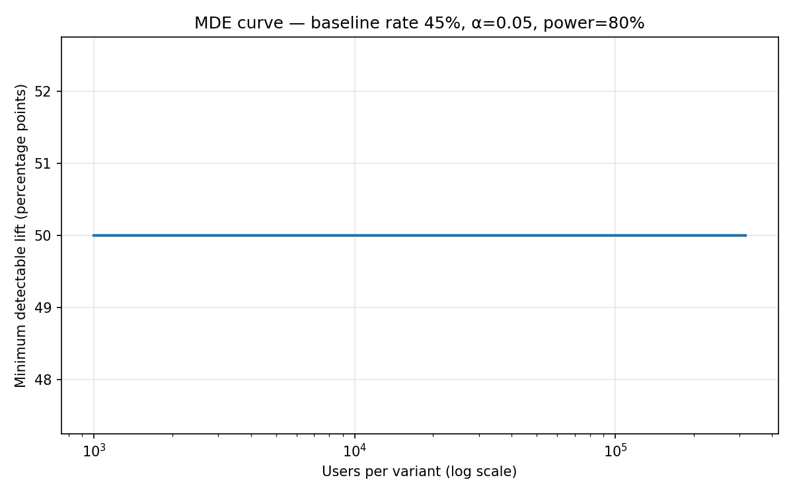
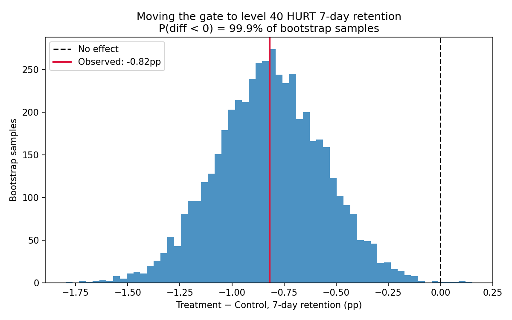
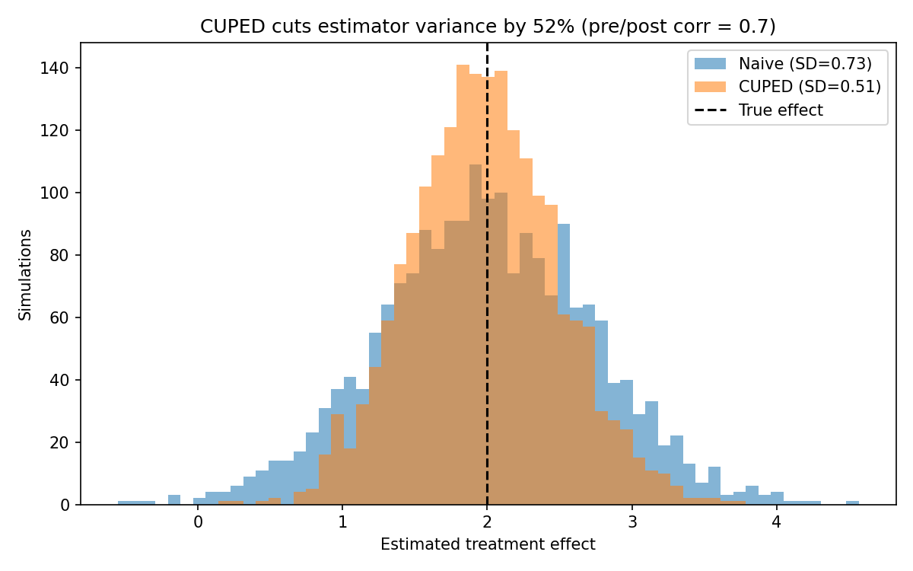
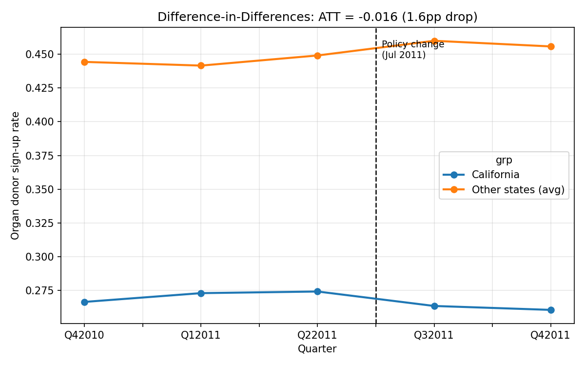

# Experimentation Toolkit

A/B testing and causal inference methods, applied end to end: designing a test, evaluating results, reducing the sample size needed, and measuring impact when randomization isn't an option.

## Why I built this

Most of my day-to-day analytics work involves reporting on things that already happened. The harder question is whether a change actually *caused* the result, and that's the skill I wanted to practice properly. This repo works through the full experiment lifecycle on real data: a published 90k-user mobile game A/B test (Cookie Cats) and a real policy change (California's 2011 organ donor registration redesign), plus one simulation where the true effect is known so the method can be validated against it.

## Contents

| Module | Question | Method |
|---|---|---|
| `src/power_analysis.py` | How many users does the test need? | Power analysis, MDE curves |
| `src/ab_test.py` | Did the change move the metric? | Two-proportion z-test, CIs, bootstrap |
| `src/cuped.py` | Can we get answers with less traffic? | CUPED variance reduction |
| `src/did.py` | What if we can't randomize? | Difference-in-differences |

## Results

### Power analysis

On a 44.8% baseline retention rate (alpha=0.05, power=80%), detecting a +1pp lift takes about 39,000 users per variant. A +0.5pp lift takes about 155,000. Running this calculation before launch is the difference between a real experiment and an underpowered one that can't detect anything.



### The Cookie Cats A/B test

The game moved its first progression gate from level 30 to level 40, expecting that delaying friction would improve retention. It didn't:

| Metric | Control | Treatment | Lift | 95% CI | p-value |
|---|---|---|---|---|---|
| 1-day retention | 44.81% | 44.22% | -0.59pp | [-1.24, +0.06] | 0.073 |
| 7-day retention | 19.01% | 18.19% | -0.82pp | [-1.33, -0.31] | 0.002 |

The 1-day result on its own is inconclusive. The 7-day result shows a real loss, and a bootstrap check agrees: essentially all resamples come out negative. The right call here is not to ship the change. One data note: a single account with ~50k game rounds (almost certainly a bot) is excluded before analysis.



### CUPED

Using each user's pre-experiment behavior as a covariate removes predictable variance from the experiment metric. In this simulation (pre/post correlation of 0.7), variance drops by about 52%, which is equivalent to needing roughly half the sample for the same statistical power. Since the simulation has a known true effect, it also confirms the estimator recovers it without bias. This technique is standard at companies like Microsoft and Netflix because traffic is usually the constraint on how many experiments you can run.



### Difference-in-differences

In July 2011, California changed its driver's license organ donor question from opt-in to "active choice." Comparing California's before/after shift against states that didn't change (two-way fixed effects, standard errors clustered by state), the redesign reduced sign-up rates by 1.6pp (p < 0.001). The pre-period trends for the two groups are parallel, which supports the identifying assumption. This is the kind of method I'd reach for on pricing changes or market-level rollouts where an A/B test isn't possible.



## Running it

```bash
pip install -r requirements.txt
python src/power_analysis.py
python src/ab_test.py
python src/cuped.py
python src/did.py
```

Figures and result tables are written to `figures/`.

## Data sources

- Cookie Cats A/B test: 90,189 players, published by Tactile Entertainment (via DataCamp)
- Organ donations: Kessler & Roth (2014), from the [`causaldata`](https://pypi.org/project/causaldata/) package
- CUPED: simulated with a known true effect, since the method requires pre-experiment data
